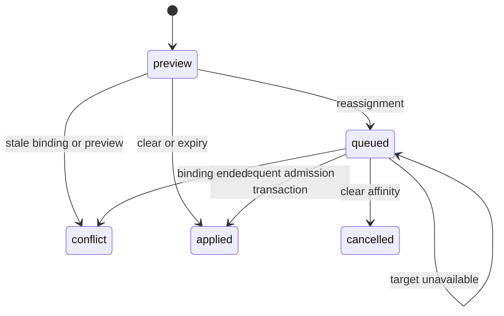

# Session pin controls, version 1

These operator controls act on one exact retained `(routing identity hash, physical model)` binding. They never migrate an admitted request, change its credentials, substitute its model, or reconstruct a client agent hierarchy.

## API

All paths start with `/api/admin/session-pins`. Every operation requires an operator credential, even when dashboard login is disabled. POST operations also require a loopback peer. Responses use `Cache-Control: no-store`; bodies are bounded to 32 KiB and unknown fields are refused.

* `GET /?limit=25&before=<pinId>` pages retained pins by their stable composite key, at most 50. Each row includes at most eight exact request joins, switch receipts and control actions, plus up to 201 same-provider target choices. Target lists at that bound may be incomplete; the simulator separately refuses captures over 200 accounts.
* `POST /preview` takes `{id?, pinId, expectedRevision, action, targetConnectionId?, deadline?}`. `id` is an optional client UUID for idempotency. Actions are `clear`, `expire` and `reassign`. Only reassign accepts a target; only expire accepts a canonical UTC ISO deadline, at most 30 days ahead. Preview writes a durable audit record without changing affinity or reserving a lease.
* `POST /apply` takes only `{id, expectedRevision}` from a preview. A preview is valid for five minutes. The current binding and expiry must match its revision; activity extending the idle deadline requires another preview. Expired or changed state returns a durable conflict receipt with HTTP 409. Repeating the same apply returns its existing receipt; reusing a preview UUID with another payload is refused.
* `GET /actions/<id>` retrieves a durable receipt even after its pin or context history has been removed.

Pin IDs encode the existing hash and physical model. They are reversible opaque identifiers and remain linkable pseudonymous data. They contain neither a raw client identifier nor a credential. Read access is operator-only. Exact session joins require the same full stored hash in `contextSessions`, with `explicit`, `inferred` or legacy `routing` provenance. A per-request fallback identity is never joined. `servedModel` is populated only for a successful recorded request; unknown historical values remain null. The request list spans retained history for this identity and physical model, including earlier bindings, not just the current account.

## State changes and admission

`clear` deletes the pin and cancels a queued reassignment in the same transaction. The next selection uses ordinary ranking and may choose the same account. No response finalizer writes affinity, so completing an older request cannot restore a cleared pin.

`expire` writes an absolute operator deadline and caps the current expiry without extending it. A NULL current expiry is uncapped. Normal touches retain the earlier of the operator deadline and the sliding 24-hour idle expiry. Once the binding ends, a fresh binding has the normal idle policy. Requests already admitted continue unchanged.

`reassign` queues one same-model target. The existing pin remains until the target passes normal account/model, quota, proxy and capacity checks. An explicit different account in a subsequent request, a target that cannot accept, or a command changing during admission returns `mustWait`; callers must not fall through to another account or model. The gateway checks the command again after asynchronous admission reads. It then reserves the target, writes the pin and switch receipt, and marks the action applied in one synchronous SQLite transaction. Applied means account selection, not upstream dispatch, successful generation or billing confirmation.

There is no claimed worker or half-consumed state. A failure before commit rolls back the binding, action and switch receipt; the process-local reservation is released. A process restart reads the queued action again. A committed action is consumed once. Commands tied to an older binding cannot move a newer binding. Administrative writes and consumption require a native SQLite adapter; the deferred sql.js snapshot writer is explicitly unsupported for durable commands. Existing uncommanded selection retains its existing adapter behavior.

Preview uses the maintained captured-state simulator and reports its exclusions and unknown evidence. It does not contact providers, refresh quota, warm caches, mutate routing configuration or prove future client-key restrictions. Its capture is not an atomic view across repositories and process-local load. Unsupported physical topology returns an explicit refusal. Local lease counts are process-local; this feature does not introduce a distributed concurrency gate.

The scheduler otherwise keeps healthy pins stable. New placement still ranks the longest reset horizon first, with subsequent horizons as tie breakers and capacity admission selecting an available slot. Moving accounts may rebuild a prompt cache; clearing affinity does not promise either movement or a cache hit.
